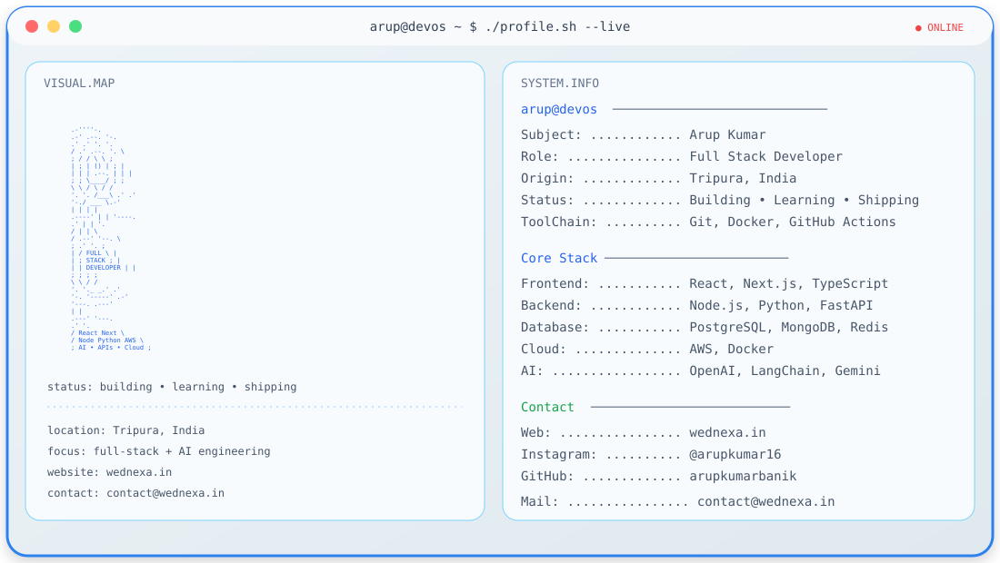

👋 Hi, I'm Arup Kumar

Full Stack Developer · AI Builder · Cloud Enthusiast

 

🧰 Tech Stack

<strong>AI:</strong> OpenAI · LangChain · Gemini

📊 GitHub

  

🚀 What I Build

Full-stack web applications, scalable APIs, cloud deployments, and AI-powered products using React, Next.js, Node.js, Python, FastAPI, PostgreSQL, MongoDB, Redis, AWS, Docker, OpenAI, LangChain, and Gemini.

📫 Contact

🌐 Website: https://wednexa.in

📧 Email: contact@wednexa.in

📸 Instagram: https://instagram.com/arupkumar16

💻 GitHub: https://github.com/arupkumarbanik
